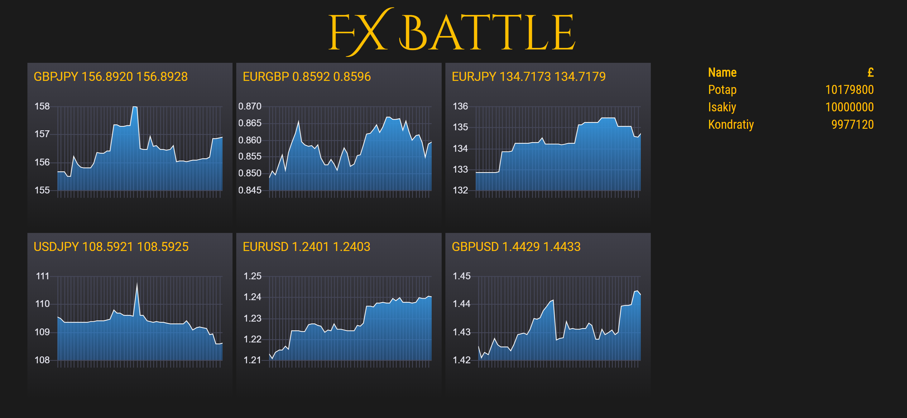

# FX Battle



A not quite optimal fx exchange, providing plenty of opportunity to make money.
Write trading robots to compete against other traders! The team with most money
in the end wins.

## Main concepts

You have some initial amount of money. You can exchange it as you wish.

Every buy/sell order you submit has a trading fee, which you need to take into account.

This market is more volatile than its real world counterparts. This presents both
opportunity and danger. Choose your strategies carefully.

It is possible to ensure your transactions are making money. I can neither confirm
nor deny that this is a winning strategy. I actually can't, don't know yet.

Since we are based in the UK, your success will be measured in British pounds.

## Trading API's

### Judge the situation in the market

Request:

```
GET /market
```

Response:

```json
{
  "EURUSD": "EURUSD 1.2321 1.2323",
  "EURGBP": "EURGBP 0.7874 0.7878"
}
```

The first price is bid, the second one is ask. Bid is how much people are willing
to pay you, ask is how much people want in order to sell to you.

In the above example:

- To exchange EUR to USD (sell EURUSD), you will receive 1.2321 USD per 1 EUR you sell.

- To exchange USD to EUR (buy EURUSD), you will have to pay 1.2323 USD for each EUR you buy.

### See your account details

Request:

```
GET /account/<api_key>
```

Response:

```json
{
    "EUR": 123.23,
    "GBP": 10000.00,
    "USD": 123.34,
    "JPY": -12.0234
}
```

Returns how much of every currency you have. Can get slightly negative due to
execution quirks (assume that every account has a small overdraft).

### Trade currency

Request

```
GET /trade/<api_key>/<buy|sell>/<ccy_pair>/<amount>
```

Response: either your account details, or

```json
{
    "error": "Explanation why the trade has not been successful"
}
```

Executes the trade. For example, `/trade/api_key123/sell/GBPUSD/100.0` would
try to exchange 100 GBP for USD at the market rate.

You can specify currency pairs in whichever quoting convention is more convenient,
e.g. if GBPUSD trades at 2.0, then `sell/GBPUSD/100.0` and `buy/USDGBP/200.0`
are equivalent.

The fixed trading fee will always be applied. It is the same regardless of the
currency of your trade, e.g. 10 GBP. The fee will be converted at the market rate
and taken from the amount you are receiving. E.g. if you are selling 100 USD
and expecting to receive 10000 JPY, and 1 GBP is 200 JPY, you will receive
8000 JPY.

## Trading tips

### Bid vs Ask

Theory: In the real market there are traders on both sides submitting limit orders, specifying
at which price they want to buy or sell. People want to buy cheap and sell expensive,
hence the spread between Bid price (how much they are bidding to buy currency from you) and
Ask price (how much they are asking in order to sell to you). The trade only happens when
both parties agree on the price. You are trading by placing market orders, which means
you agree to pay whatever price the market offers.

Practice: Because you agree to pay whichever price the market offers, you are always
on the disadvantaged side. To figure out which rate applies to you, pick the one
that leaves you worse-off: you are paying more when buying and receiving less when selling.

Alternatively, you can use this lookup table.
Assuming that the quote is *GBPUSD 1.9 2.1* (Bid 1.9, Ask 2.1), the amount is *1000*,
and the fee is *10 GBP*:

Action       | rate        | Pay               | Receive
---------------------------------------------------------------------------
Buy GBPUSD   | Ask         | 1000 * 2.1 USD    | 1000 GBP - 10 GBP
Buy USDGBP   | 1/Bid       | 1000 * 0.5263 GBP | 1000 USD - 20 USD
Sell GBPUSD  | Bid         | 1000 GBP          | 1000 * 1.9 USD - 20 USD
Sell USDGBP  | 1/Ask       | 1000 USD          | 1000 * 0.4762 GBP - 10 GBP

Note how the exchange always takes the fee from the amount received. It converts 
10 GBP to the correct currency using the *mid price* (`(1.9 + 2.1) / 2 = 2.0`).

### Overdraft

The market can move during the execution of your trade. This means that even if you had 
enough money before you submitted your order, you might no longer have enough by the time
the exchange receives it. To smooth out such inconveniences, there's a small interest-free
overdraft given to your account (this is not how it works IRL). This means your balance
can get negative for a certain currency. In that case, you will have to buy this
currency before you can trade it again.

## Example traders and client libraries

[examples](./examples)

Some example traders and client libraries for various languages are in the [examples](./examples) directory

- [python3](./examples/python)
- [javascript (nodejs v6.0)](./examples/javascript)

Please feel free to contribute your libraries


## Running the exchange

Depends on:

```
g++-7
cmake
libboost-all-dev
```

With dependencies installed:

```bash
git clone --recursive https://github.com/nadvamir/trading-game.git
cd trading-game
make
```

Port is specified in *config.json*. If the exchange fails to bind to port 80,
might have to either run it as a root or, preferably, setup port routing from 
80 to something the exchange can bind to.

Pass-in *.sav* files as arguments when starting FXBattle.exe in case of emergency
to (mostly) restore the state.

